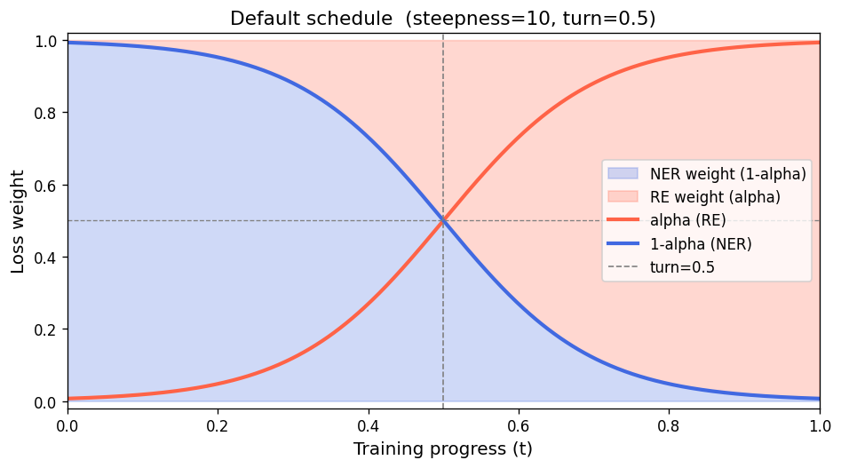
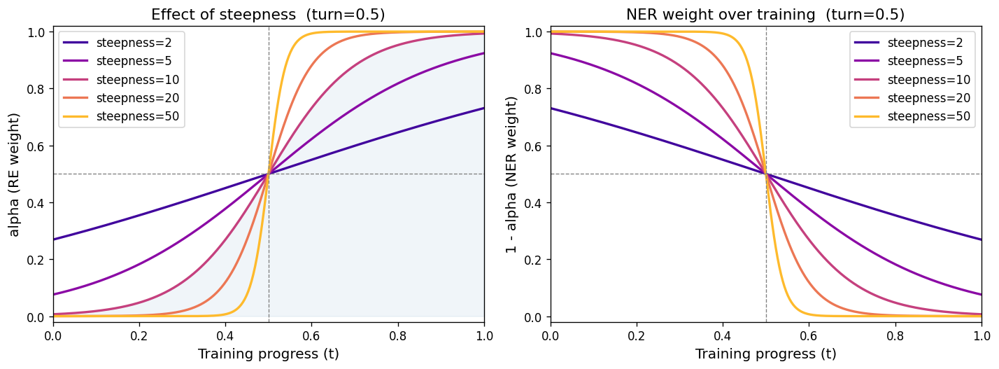
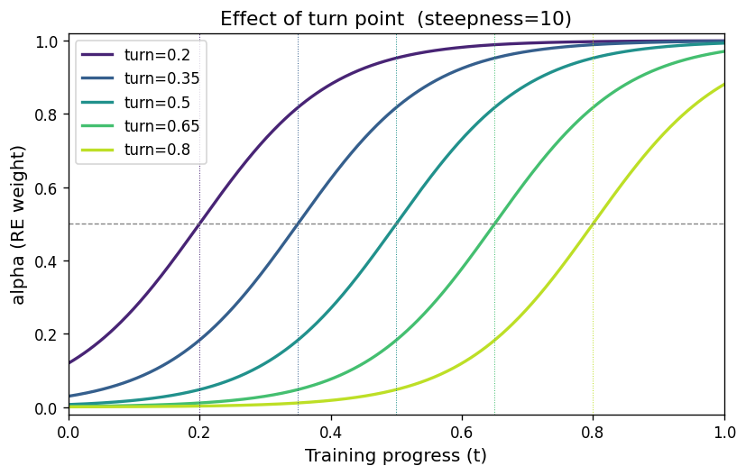

# Train-Time Dynamic Loss Weighting

## Motivation

HGERE is trained jointly on two objectives:

- **NER loss** — entity span classification
- **RE loss** — relation classification between entity pairs

With a fixed weighting (`--loss_re_weight_alpha`), both tasks compete equally from the very first
step. In practice, the model first needs to learn which spans are entities before it can learn
meaningful relations between them. Starting with a high RE weight too early can hinder NER
convergence, while ending training with a high NER weight wastes capacity on a task that is
already solved.

The dynamic weighting scheme shifts focus **from NER to RE** over the course of training, following
a sigmoid ("phase transition") curve.

---

## Formula

At each optimiser step the weight `alpha` (the RE share of the loss) is computed as:

```
t     = global_step / t_total          # training progress in [0, 1]
alpha = sigmoid( steepness * (t - turn) )
      = 1 / (1 + exp( -steepness * (t - turn) ))

loss  = alpha * re_loss + (1 - alpha) * ner_loss
```

| Symbol       | Argument                        | Default | Meaning |
|--------------|---------------------------------|---------|---------|
| `turn`       | `--train_time_loss_turn`        | `0.5`   | Progress fraction where alpha = 0.5 (midpoint of the transition) |
| `steepness`  | `--train_time_loss_steepness`   | `10.0`  | Controls how sharply the transition happens around the turn point |

- At `t = 0` (start): `alpha ≈ 0` → training is dominated by **NER loss**
- At `t = turn`: `alpha = 0.5` → equal weighting
- At `t = 1` (end): `alpha ≈ 1` → training is dominated by **RE loss**

---

## Parameters

### `--train_time_loss_weighting`

Boolean flag. Enables the dynamic schedule. When absent, the static
`--loss_re_weight_alpha` is used as before.

> **Warning:** If you set both `--train_time_loss_weighting` and a non-default
> `--loss_re_weight_alpha`, the static value is silently ignored and a warning is printed.

### `--train_time_loss_turn` (default: `0.5`)

The training progress value at which `alpha = 0.5` (equal NER/RE weighting). Moving the turn
point earlier (e.g. `0.3`) gives the model less time to focus on NER before shifting to RE. Moving
it later (e.g. `0.7`) extends the NER-focused phase.

### `--train_time_loss_steepness` (default: `10.0`)

Controls how abruptly the transition happens:

- Low values (e.g. `2–5`): gradual linear-like shift over most of training
- Default (`10`): noticeable but smooth transition within roughly 30–40% of training around `turn`
- High values (e.g. `≥ 20`): near step-function — abrupt switch at `turn`

---

## Visualisations

### Default schedule (`steepness=10`, `turn=0.5`)



The NER weight (blue) dominates the first half of training; the RE weight (red) takes over in the
second half. The crossover is at `t = 0.5`.

---

### Effect of steepness (`turn=0.5`)



**Left:** RE weight (`alpha`) for different steepness values.
**Right:** NER weight (`1 - alpha`).

Higher steepness values produce a sharper phase transition. At `steepness=50` the curve is almost
a step function; at `steepness=2` it looks nearly linear.

---

### Effect of turn point (`steepness=10`)



Moving the turn point earlier shifts the entire transition left, giving RE learning more total
training time. Moving it later extends the NER-dominated phase.

---

## Example Usage

```bash
# Enable dynamic weighting with defaults (turn=0.5, steepness=10)
python run_hgnn.py --train_time_loss_weighting ...

# Shift transition earlier and make it sharper
python run_hgnn.py --train_time_loss_weighting \
    --train_time_loss_turn 0.3 \
    --train_time_loss_steepness 20 ...

# Gradual blend, transition centred at 60% of training
python run_hgnn.py --train_time_loss_weighting \
    --train_time_loss_turn 0.6 \
    --train_time_loss_steepness 5 ...
```

---

## WandB Logging

When dynamic weighting is active, the following metrics are logged at each `--logging_steps`
interval:

| Key | Description |
|-----|-------------|
| `train/loss_weight/alpha_re` | Current RE weight (`alpha`) |
| `train/loss_weight/alpha_ner` | Current NER weight (`1 - alpha`) |

These are logged alongside `train/loss/re` and `train/loss/ner` so you can correlate weight
evolution with loss behaviour.
